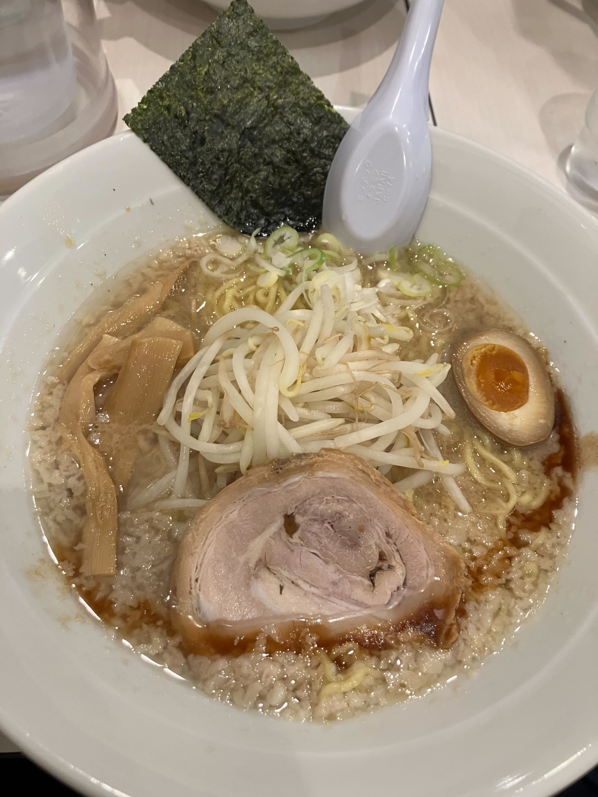
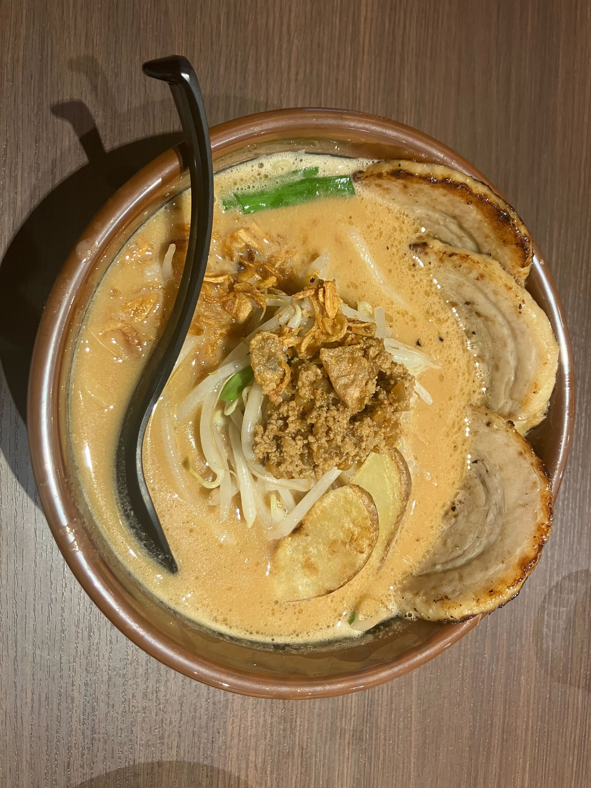
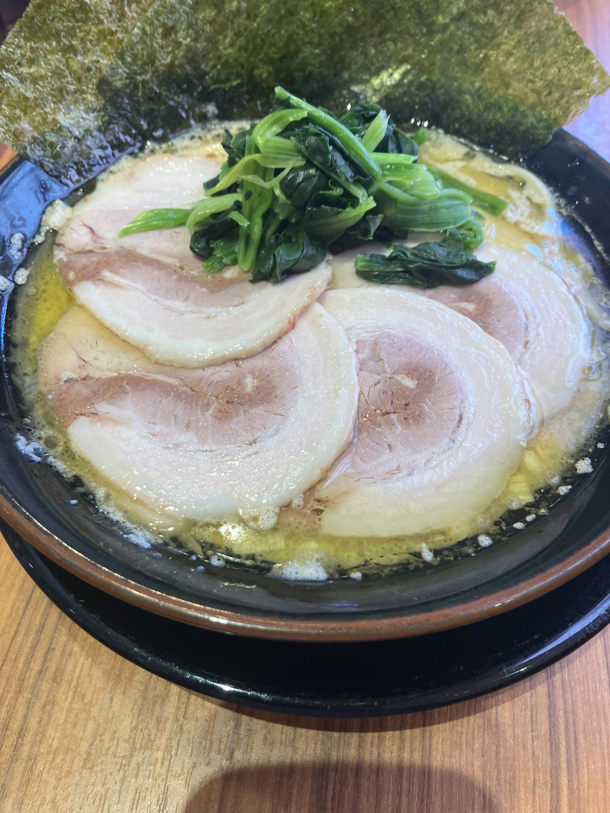

<<<<<<< HEAD
# me
=======

# 自己紹介ディクショナリー
#LIST
mylist=["我如古隼人","1254810215","ゲーム","ラーメン"]

#dicsyonary
#myinfy
myinfo = {
    '名前': '我如古隼人',
    '学籍番号': '1254810215',
    '趣味': 'ゲーム',
    '好きな食べ物': 'ラーメン'
}
print(myinfo)

>>>>>>> c0055a7 (RESDMEと写真の追加)
